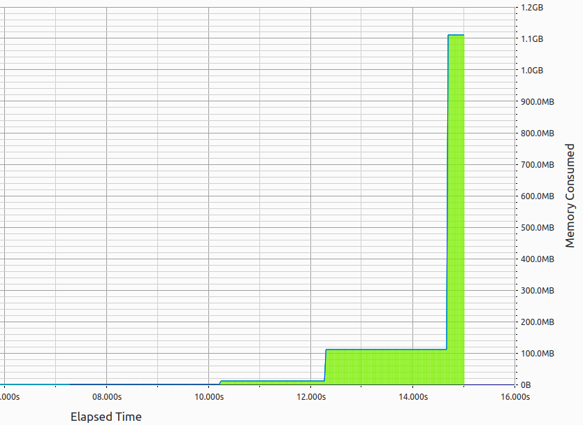

## To Run

Use `make run` to run the program.

## Description

The program will allocate X bytes to the heap, and the memory can be inspected via `top -p <pid>` and `/proc/<pid>/maps`. You will see the Virtual Memory grows and the heap gets resized.

On 32 bit systems, this program will run out of Virtual Address space at about 4GB (2^32 or 4.2e9), but on 62 bit systems, the limit is 16EB (2^64 or 1.8e19). i.e. we effectively don't need to worry about virtual address space on modern systems.

## Other targets

`make debug` - Run the program under gdb

`make heaptrack` - Run the program under heaptrack. This tracks which functions allocate memory and identifies memory leaks:

